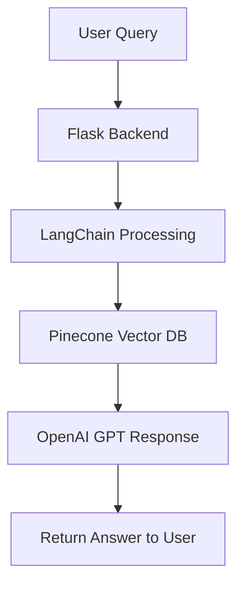

# 🩺 Medical Chatbot using LLMs, LangChain, Pinecone, and Flask  

This repository implements a **Medical Chatbot** powered by **Large Language Models (LLMs)** using **LangChain, GPT, Pinecone, and Flask**. The chatbot provides medical-related responses, allowing seamless interaction through a web interface.  

It also supports **CI/CD deployment on AWS** with Docker, ECR, EC2, and GitHub Actions.  

---

## 🚀 Features  

- Conversational **Medical Chatbot** with GPT  
- **Context-aware responses** using Pinecone vector DB for embeddings  
- **LangChain** framework for chaining LLM tasks  
- **Flask-based API & Web UI**  
- **AWS Deployment pipeline** with Docker, GitHub Actions, and EC2  
- **Secure authentication** using environment variables  

---

## 📦 Tech Stack  

- **Programming Language:** Python  
- **Frameworks:** LangChain, Flask  
- **LLMs:** OpenAI GPT  
- **Vector DB:** Pinecone  
- **Deployment:** AWS (ECR, EC2, GitHub Actions)  
- **Containerization:** Docker  

---

## ⚙️ Installation  

Follow the steps below to set up the project locally.  

### 1. Clone the Repository  

```bash
git clone https://github.com/riteshpp05/Medical-chatbot.git
cd Medical-chatbot
```

### 2. Create Virtual Environment  

```bash
python -m venv medibot
# Activate environment
# For Linux/Mac
source medibot/bin/activate
# For Windows
medibot\Scripts\activate
```

### 3. Install Requirements  

```bash
pip install -r requirements.txt
```

### 4. Setup Environment Variables  

Create a `.env` file in the root directory:  

```ini
PINECONE_API_KEY = "your-pinecone-api-key"
OPENAI_API_KEY = "your-openai-api-key"
GOOGLE_API_KEY = "your-google-api-key"
```

---

## 🧠 Store Embeddings  

Run the following command to generate and store embeddings in Pinecone:  

```bash
python store_index.py
```

---

## ▶️ Run the Application  

```bash
python app.py
```

Now, open your browser and visit:  

```
http://127.0.0.1:5000
```

---

## ☁️ AWS Deployment Guide  

### 1. IAM Setup  
Create an **IAM User** with the following permissions:  

- `AmazonEC2ContainerRegistryFullAccess`  
- `AmazonEC2FullAccess`  

---

### 2. Create an ECR Repository  

```bash
# Example ECR URI
821449936414.dkr.ecr.us-east-1.amazonaws.com/medical-bot
```

Save the URI for later use.  

---

### 3. Setup EC2 Instance  

- Launch an **Ubuntu EC2 instance**  
- Install Docker  

```bash
sudo apt-get update -y
sudo apt-get upgrade -y
curl -fsSL https://get.docker.com -o get-docker.sh
sudo sh get-docker.sh
sudo usermod -aG docker ubuntu
newgrp docker
```

---

### 4. Configure EC2 as Self-Hosted Runner  

1. Go to **GitHub → Settings → Actions → Runners → New Self-Hosted Runner**  
2. Choose **Linux/Ubuntu** and follow the commands provided  
3. Run the runner on your EC2 machine  

---

### 5. GitHub Secrets  

Add the following secrets in **GitHub → Settings → Secrets and variables → Actions**:  

- `AWS_ACCESS_KEY_ID`  
- `AWS_SECRET_ACCESS_KEY`  
- `AWS_DEFAULT_REGION`  
- `ECR_REPO`  
- `PINECONE_API_KEY`  
- `OPENAI_API_KEY`  

---

### 6. Deployment Flow  

1. Build Docker image of the source code  
2. Push image to AWS **ECR**  
3. Launch **EC2** instance  
4. Pull image from ECR into EC2  
5. Run Docker container on EC2  

---

## 📋 Project Workflow  




